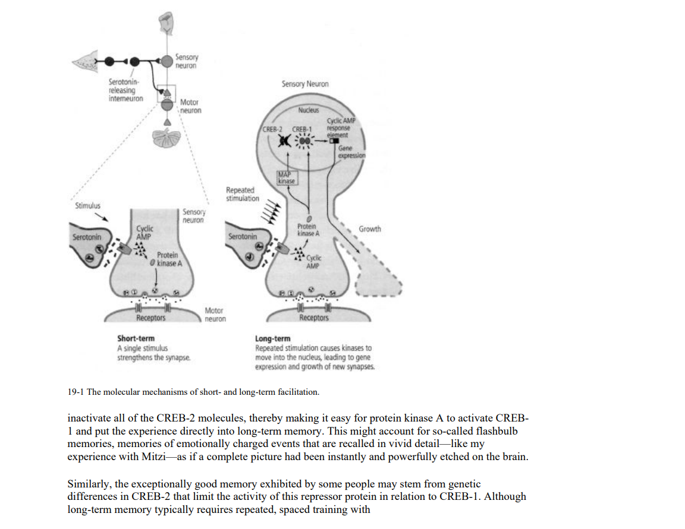

# Simulation of Conditioned Reflex By Golang

  This Project is about simulating the neural system of conditioned reflex using go programing language.

- Related Tech
  - golang is main programing language, and a little python, js, html, css.
  - [dgraph](https://dgraph.io/docs/badger/)
  - [python-websocket](https://websockets.readthedocs.io/en/stable/intro/index.html), [go-websocket](github.com/gorilla/websocket)
  - [force-graph](https://github.com/vasturiano/force-graph)
  
- Project Detail
  - This project is inspired by a book named "[In search of memory](https://docuwiki.net/index.php?title=In_Search_of_Memory)", a book about the neurological principles of human learning. Let's look at the picture below:
  
  This picture is the part of mechanism of long-term memory in biological, I extracted the function of neures to code of this project.
  - I have implemented long-term-memory mechanisms and visualized it for now. But still have no idea about how to use these mechanisms to implement the whole process of human mind.
  - Here is the picture of visualization running on golang:
